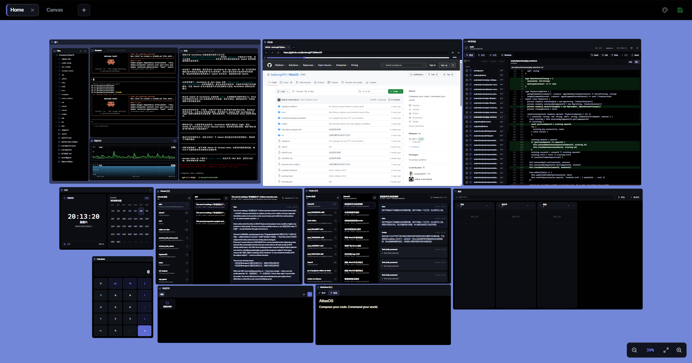

# AtlasOS

AtlasOS is a local-first infinite canvas workbench for developer workflows. Each top-level tab is a canvas document, and components such as terminals, file trees, browsers, and Markdown notes bind to their own resources instead of forcing the whole canvas to map to one folder.

## Preview



## Stack

- Electron 42.1.0, React 19, TypeScript, electron-vite
- Radix UI primitives and Tailwind CSS 4
- React Flow for the infinite canvas
- node-pty and xterm.js for terminals
- WebContentsView for embedded browser tabs
- react-arborist for the file tree
- CodeMirror 6 for Markdown notes
- Local JSON persistence with schema validation and migrations

## Commands

```bash
npm.cmd install
npm.cmd run dev
npm.cmd run build
npm.cmd run test
npm.cmd run package:win
```

PowerShell may block the `npm` shim on Windows machines with restricted execution policy. Use `npm.cmd` in that case.

`electron-vite` expects the Electron runtime to be installed under `node_modules/electron/dist`. Electron 42 can leave the npm package installed without the runtime binary when lifecycle downloads are skipped or blocked, so `npm.cmd run dev` first runs `npm.cmd run ensure:electron`. The project `.npmrc` sets an Electron mirror and project-local cache; override `ELECTRON_MIRROR` or `npm_config_electron_mirror` if your network needs a different source.

The default dev script sets `NO_SANDBOX=1` because Electron 42's Chromium sandbox can fail to grant GPU/network cache access in constrained Windows dev environments, which leaves the app stuck after `start electron app...`. This is development-only; production windows still use `contextIsolation`, disabled Node integration, and renderer sandbox settings. Use `npm.cmd run dev:sandbox` if you want to test the stricter development path on a machine where Chromium sandboxing works normally.

AtlasOS uses Chromium's normal GPU compositor by default. If a constrained Windows VM or sandbox cannot start with hardware acceleration, run development with `ATLAS_FORCE_SOFTWARE_RENDERING=1`; this enables Electron's software rendering fallback for that session only.

## Windows packaging prerequisites

The terminal component uses `node-pty`, so Windows packaging must rebuild a native module for the Electron ABI. Install Visual Studio 2022 Build Tools with the "Desktop development with C++" workload before running `npm.cmd run package:win`.

The npm scripts set `npm_config_devdir=.electron-gyp` so Electron header caches stay project-local where possible. Some node-gyp versions may still use the user profile cache when rebuilding native modules.
