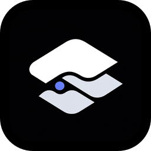

# AtlasOS

<p align="center">
  
</p>

<p align="center">
  <a href="README.md">简体中文</a> | English
</p>

<p align="center">
  <strong>A local-first infinite canvas workbench that puts terminals, files, browsers, notes, Git, remote servers, and AI agent workflows on one desktop canvas.</strong>
</p>

AtlasOS is a desktop workbench built with Electron and React. It does not force an entire workspace to map to a single folder. Instead, each canvas node can bind to its own resource: one node can be a local terminal, another can be a project directory, webpage, Markdown note, Git repository, SSH remote server, or Claude/Codex history session.

Each top-level tab is an independent local canvas document. The canvas persists nodes, groups, positions, sizes, viewport, and background settings, making it suitable for organizing long-running projects, temporary debugging, reference reading, task boards, and AI coding agent sessions in one visual space.

## Preview


## Who It Is For

- Developers who maintain multiple projects and want terminals, directories, web references, Git status, task boards, and notes on the same visual workbench.
- Heavy Codex and Claude Code users who need to know whether an agent is still running, waiting for confirmation, completed, or failed.
- Engineers who often switch between local projects, remote servers, browser references, and Markdown notes, and want to reduce window switching.
- Personal tool users who want local-first workspace persistence plus optional AI translation, screenshot OCR, daily summaries, and plugin extension.
- Plugin authors who want to build custom workflow nodes without maintaining a full Electron application shell from scratch.

## Typical Workflows

1. **Project cockpit**: Create a canvas for a project, drop in the repository folder to create a Files node, then add Terminal, Git Manager, Browser, Markdown Note, and Kanban nodes to keep development, debugging, references, and tasks on one screen.
2. **AI agent supervision desk**: Run Codex or Claude from a Terminal node, let the floating Pet show waiting/completed/error states, then review sessions and usage through Claude History, Codex History, and Agent Usage.
3. **Reference reading and translation**: Read docs in Browser, select text and press Ctrl twice to translate it, or use screenshot OCR/translation for images, screenshots, or text that cannot be selected.
4. **Remote operations workspace**: Use Remote Server for SSH/SFTP, and place remote shell, remote file tree, local terminal, Git status, and sticky notes on one canvas.
5. **Personal extensible toolbox**: Pin common apps, folders, URLs, and commands with Quick Launcher, then add custom local plugin nodes for specialized workflows.

## Highlights

- **Local-first infinite canvas**: Multiple canvas tabs, freeform layout, zooming, node resize, node finder, file drop node creation, node grouping, group notes, and background customization.
- **Full development node set**: Built-in Terminal, Files, Browser, Git Manager, Remote Server, File Preview, and more, so local and remote development context can live on the same canvas.
- **Double Ctrl translation and screenshot OCR**: Press Ctrl twice in AtlasOS, inside embedded webpages, or in other Windows applications to translate selected text. If no text is selected, AtlasOS enters screenshot selection mode for OCR, screenshot translation, and copying images/text/translations.
- **Floating Pet**: A transparent always-on-top floating window that shows Kanban due reminders and Codex/Claude running, waiting, completed, and error notifications. It supports native notifications, sounds, and custom image/video/sprite assets.
- **AI agent workbench**: Index local Claude/Codex history, browse sessions, view transcripts, resume terminals, inspect yearly usage heatmaps, and generate AI daily summaries.
- **Trusted local plugin system**: Plugins are installed as local folders and declare nodes, configuration, renderer/native entrypoints in `atlas-plugin.json`. They can register new canvas nodes or run native work in an isolated Electron `utilityProcess`.
- **Desktop resident experience**: Closing the main window hides it to the tray by default. The tray menu can reopen AtlasOS, open Settings, or quit. Packaged builds provide update checks, download progress, and install-and-restart UI.
- **Clear security and privacy boundaries**: Canvas data and settings are stored locally by default. AI keys, remote server passwords, and passphrases are encrypted with Electron `safeStorage`. Renderer windows run with sandboxing, context isolation, and Node integration disabled.

## Built-In Nodes

| Category | Node | Role | Highlights |
| --- | --- | --- | --- |
| Development | **Terminal** | Local shell terminal | Built on `node-pty` and xterm.js. Supports command library, node-level/global environment variables, node locking, file path paste, clipboard image-to-temp-asset insertion, and Codex/Claude command/session tracking. |
| Development | **Files** | Local directory tree | Lazy tree loading, directory watching, create/rename/delete to trash, copy path, reveal in OS folder, open terminal for a directory, and open files as Markdown or File Preview nodes. |
| Development | **File Preview** | File preview node | Created from file drops or file tree actions. Supports text read/edit/save, code highlighting, image preview, video preview, and media aspect-ratio memory. |
| Development | **Browser** | Embedded web browser | Multi-tab `webview`, address bar, back/forward/reload, DevTools, screenshot, zoom, and double Ctrl translation from selected webpage text. Without a selection it enters screenshot capture. |
| Development | **Git Manager** | Git repository panel | Bind a local repository, inspect status/log/branches/stashes, view split/unified diffs, stage/unstage, commit selected or staged files, create/switch/delete branches, fetch/pull/push, and apply/pop/drop stashes. |
| Development | **Remote Server** | SSH/SFTP remote server | SSH profile management, host key confirmation, remote shell, remote file tree, upload/download, create, rename, delete, text editing, and remote status sampling. Credentials are encrypted with `safeStorage`. |
| Planning | **Markdown Note** | Markdown note | Edit/preview modes with GFM, math/KaTeX, and code highlighting. Dropped Markdown files can initialize note nodes. |
| Planning | **Sticky Note** | Sticky note | TipTap rich text editing with bold, italic, underline, alignment, background colors, font size presets, automatic font sizing, and title derivation from content. |
| Planning | **Sketch** | Whiteboard | Excalidraw-based sketch surface that saves elements, appState, and files. Text elements can be searched by the node finder. |
| Planning | **Kanban** | Task board | Drag/drop columns and cards, column WIP limits, card title/description/labels/priority/assignee/due date, filters by label/assignee/priority, and due/overdue reminders through the floating Pet. |
| Planning | **Calendar** | Calendar and clock | Current time, timezone, month calendar, localized week start, and compact mode. |
| Utilities | **Quick Launcher** | Shortcut launcher | Tabbed shortcuts for app/file/folder/url/command entries, with icons, drag sorting, PowerShell/cmd commands, and launch debounce. |
| Utilities | **System Monitor** | System monitor | CPU and memory samples every second, with gauge view and historical wave view. |
| Agent | **Claude History** | Local Claude history browser | Browse local history by project/session, view transcripts, open project terminals, and resume sessions. |
| Agent | **Codex History** | Local Codex history browser | Browse Codex history by project/session, view message records, open project terminals, and resume sessions. |
| Agent | **Agent Usage** | Agent usage calendar | Scans local Claude/Codex JSONL history into SQLite, shows yearly heatmaps, daily token/session/tool stats, model/project distributions, and can generate AI daily summaries. |

`File Preview` is not a normal create-menu node. It is created from file drops, file tree actions, or other file entrypoints so the file binding is preserved.

## Canvas Workflow

- **Multiple canvas documents**: Top tabs support create, rename, reorder, and delete. Each tab maps to an independent local canvas document.
- **Node creation**: Double-click the canvas or press the default `Tab` shortcut to open the create menu. Nodes are grouped by Development, Planning, Utilities, Agent, and other categories.
- **Node search**: `Ctrl+F` opens the node finder. Some nodes expose internal text, file names, or task titles as search tokens.
- **Grouping**: `Ctrl+G` groups selected nodes, and `Ctrl+Shift+G` ungroups them. Groups support titles, notes, resize, and moving as a unit.
- **Fast duplication**: Hold `Alt` while dragging to duplicate nodes or groups.
- **File drop**: Directories become Files nodes. Markdown files become Markdown Note nodes. Supported text, image, and video files become File Preview nodes.
- **Background settings**: Configure canvas color and optional background images with fit, fixed-position, and blur options.
- **Autosave**: Node state, config, bindings, canvas viewport, background, and groups are saved as JSON under Electron `userData`.

## Double Ctrl Translation And Screenshot OCR

AtlasOS translation follows a simple rule: selected text first, screenshot otherwise.

1. **Inside AtlasOS**: Select text in a terminal, input, note, or another component with registered selection support, then press Ctrl twice to open a floating translation window.
2. **Inside Browser**: Select webpage text and press Ctrl twice to translate it. Without a selection, AtlasOS starts screenshot capture.
3. **Windows system-wide**: On Windows, AtlasOS uses a low-level keyboard hook to listen for double Ctrl. It then tries to send `Ctrl+C` to capture selected text from the active external application and restore the previous clipboard where possible. If no text is captured, it starts full-screen screenshot selection.

Translation and OCR are coordinated by the main process. AtlasOS supports OpenAI-compatible `chat/completions` and Anthropic `messages`. Users can configure multiple AI profiles, Base URLs, model lists, API keys, default translation model, default daily-summary model, and target language. API keys are encrypted with Electron `safeStorage`.

Screenshot capture supports virtual screen bounds across multiple monitors. After selecting a region, users can run OCR, translate the screenshot, copy the image, copy OCR text, or copy the translation.

## Floating Pet

The floating Pet is a transparent, always-on-top, draggable mini window. It is not just decoration. It is a lightweight reminder center for AtlasOS:

- **Kanban reminders**: Periodically scans Kanban cards across canvases, emits reminders for due and overdue tasks, and can jump back to the target canvas, node, and card.
- **Agent status**: Tracks running, waiting, completed, and error states for Codex and Claude sessions.
- **Hook bridge**: Settings can install or repair Claude/Codex hooks. The Pet service starts a local token-protected bridge to receive agent events.
- **Reminder panel**: Hover the Pet to view running agents, sessions waiting for confirmation, and alerts.
- **Custom assets**: Configure image, video, or sprite assets for idle/running/attention states, assign motion effects, and add asking/completion sounds.
- **Native notifications**: Optional system notifications can open the related canvas context when clicked.

## Agent Workflow

AtlasOS treats AI coding agents as part of a long-running workflow, not just one-off command output:

- Terminal nodes detect Codex/Claude commands and report session state to the Pet service.
- Claude History and Codex History read local history records and support project/session browsing, message viewing, opening project terminals, and resuming sessions.
- Agent Usage writes historical usage into local SQLite and aggregates by date, model, project, and tool usage.
- Daily summaries can call the configured AI profile and model, helping review the day of agent activity and important changes.

## Settings Center

AtlasOS centralizes cross-node settings so each node does not need to be configured repeatedly:

- **General**: Language, update checks, and canvas shortcuts.
- **AI**: OpenAI-compatible / Anthropic profiles, Base URL, model list, and API key.
- **Applications**: Target language for translation, plus default profile and model for translation and daily summaries.
- **Terminal command library**: Maintain reusable command categories, then insert or run commands from Terminal nodes.
- **Terminal environments**: Save reusable global environment-variable sets and select them per terminal node.
- **Pet**: Floating window toggle, native notifications, agent bridge, reminder sounds, custom asset packs, and state motions.
- **Plugins**: Plugin root, scan, add folder, enable/disable, reload, uninstall, configuration, and diagnostics.

## Plugin System

AtlasOS plugins are trusted local folders. A plugin can contribute renderer nodes only, or provide an additional native runtime for OS access, long-running work, or expensive computation.

Basic plugin structure:

```text
plugin-folder/
  atlas-plugin.json
  dist/
    renderer.js
  native/
    main.js
```

Core mechanics:

- `atlas-plugin.json` declares plugin id, name, version, API version, renderer/native entrypoints, nodes, permissions, and configuration fields.
- The current plugin API version is `1`.
- Renderer plugins register nodes through `registerPlugin(api)` and use host-provided React, icons, SDK helpers, config, and `api.invoke`.
- Native plugins start through Electron `utilityProcess.fork(...)`. Renderer code can send commands to the native runtime and receive structured results.
- External plugin node types use the `plugin:<plugin-id>/<node-id>` namespace.
- Built-in nodes are also registered through the privileged `atlas.builtins` system plugin, keeping built-in and external plugin nodes on the same data model.
- If a plugin is disabled, missing, or fails to load, AtlasOS preserves the node data and shows a missing-plugin placeholder.

The Settings page supports plugin root configuration, scanning, adding a single plugin folder, enabling/disabling, reloading, uninstalling, editing plugin configuration, and viewing diagnostics. See [docs/PLUGINS.md](docs/PLUGINS.md) for details, and [examples/plugins/calculator](examples/plugins/calculator) for the smallest working example.

## Architecture

| Layer | Main Path | Responsibility |
| --- | --- | --- |
| Main process | `src/main` | Electron windows, tray, security policy, updates, system services, and IPC handlers. |
| Preload | `src/preload` | Exposes `window.atlas` through `contextBridge` so the renderer can call local capabilities through controlled APIs. |
| Renderer | `src/renderer` | React app, infinite canvas, node UI, Settings, translation window, screenshot window, and Pet window. |
| Shared | `src/shared` | Cross-process schemas, constants, types, and feature configuration. |
| Plugin SDK | `sdk/atlasos-plugin-sdk` | Plugin authoring types, helpers, and host API contracts. |
| Docs / examples | `docs`, `examples` | Design system, plugin docs, Pet asset spec, and example plugins. |

Core services assembled by the main process include:

- `CanvasPersistence` / `WorkspaceDocumentService`: Canvas document read/write, schema validation, and local JSON persistence.
- `AppSettingsService`: Application settings, language, terminal environments, AI, updates, Pet, and remote server configuration.
- `FileSystemService`: Local file read/write, directory tree, watch, search, and trash deletion.
- `PtyService`: Local terminal, cwd tracking, terminal data stream, and agent command detection.
- `RemoteServerService`: SSH shell, SFTP file operations, host key validation, and remote status.
- `BrowserService`: Embedded browser tabs, navigation, zoom, screenshots, and lightweight DOM automation IPC.
- `GitService`: Repository status, diff, log, branches, stashes, and network operations.
- `AiTranslationService`: AI profiles, keys, translation window, screenshot window, OCR, and screenshot translation.
- `PetService`: Floating Pet window, Kanban reminders, agent status, hook installation, and local bridge.
- `PluginService`: Plugin scanning, installation, enable/disable, resource protocol, renderer loading, and native runtime.
- `AgentUsageService`, `ClaudeHistoryService`, `CodexHistoryService`: Local agent history indexing, querying, and usage statistics.
- `SystemMetricsService`, `LauncherService`, `UpdateService`: System metrics, shortcut launching, and application updates.

## Data And Security

- Canvas documents are stored under Electron `userData/workspace-documents` by default.
- Application settings are stored under `userData/app-settings/settings.json` by default.
- Agent usage indexing uses `userData/database/atlas.sqlite`.
- Development mode points `userData` and `sessionData` to `.atlasos-dev` inside the repository to avoid polluting production user data.
- AI keys, remote server passwords, private-key passphrases, and other sensitive data are encrypted with Electron `safeStorage`.
- The main window uses `contextIsolation: true`, `nodeIntegration: false`, and `sandbox: true`.
- Renderer permission requests are denied by default, CSP is injected, and external window-open requests are delegated to the system browser.
- The embedded browser includes network policy protections that reduce WebRTC local network information exposure.
- Local files and plugin resources are exposed through dedicated protocols such as `atlas-file:` and `atlas-plugin:`.

## Stack

- Electron 42.1.0, React 19, TypeScript, electron-vite
- React Flow for the infinite canvas
- Radix UI primitives, Tailwind CSS 4, lucide-react for UI foundations
- node-pty and xterm.js for terminals
- Electron `webview` / BrowserService for embedded browser and lightweight automation
- react-arborist for the file tree
- CodeMirror 6, React Markdown, remark/rehype, KaTeX for Markdown and text editing
- TipTap for sticky note rich text
- Excalidraw for sketching
- dnd-kit for Kanban, Quick Launcher, and sorting interactions
- ssh2 for SSH/SFTP remote servers
- react-diff-view for Git diffs
- zod, write-file-atomic, SQLite, Electron `safeStorage` for schemas, persistence, and key protection

## Directory Structure

```text
AtlasOS/
  src/
    main/                 Electron main process, services, and IPC handlers
    preload/              contextBridge API and webview preload
    renderer/             React app, canvas, nodes, Settings, and standalone windows
    shared/               Cross-process types, schemas, and constants
  docs/                   Design system, plugin docs, Pet asset spec, and README images
  examples/plugins/       Example plugins
  sdk/atlasos-plugin-sdk/ Plugin SDK
  scripts/                Build, verification, and release helper scripts
  build/                  Application icon and build assets
```

## Development

```bash
npm.cmd install
npm.cmd run dev
npm.cmd run build
npm.cmd run test
npm.cmd run package:win
```

PowerShell may block the `npm` shim on Windows machines with restricted execution policy. Use `npm.cmd` in that case.

`electron-vite` expects the Electron runtime to be installed under `node_modules/electron/dist`. Electron 42 can leave the npm package installed without the runtime binary when lifecycle downloads are skipped or blocked, so `npm.cmd run dev` first runs `npm.cmd run ensure:electron`. The project `.npmrc` sets an Electron mirror and project-local cache. Override `ELECTRON_MIRROR` or `npm_config_electron_mirror` if your network needs a different source.

The default dev script sets `NO_SANDBOX=1` because Electron 42's Chromium sandbox can fail to grant GPU/network cache access in constrained Windows dev environments, which leaves the app stuck after `start electron app...`. This is development-only. Production windows still use context isolation, disabled Node integration, and renderer sandbox settings. Use the stricter development path when Chromium sandboxing works normally on your machine:

```bash
npm.cmd run dev:sandbox
```

AtlasOS uses Chromium's normal GPU compositor by default. If a constrained Windows VM or sandbox cannot start with hardware acceleration, run development with software rendering for that session:

```bash
set ATLAS_FORCE_SOFTWARE_RENDERING=1
npm.cmd run dev
```

## Windows Packaging Notes

The Terminal node depends on `node-pty`, so Windows packaging must rebuild a native module for the Electron ABI. Install Visual Studio 2022 Build Tools with the "Desktop development with C++" workload before running `npm.cmd run package:win`.

The packaging scripts set `npm_config_devdir=.electron-gyp` so Electron header caches stay project-local where possible. Some node-gyp versions may still use the user profile cache.

## Platform Notes

- Windows is currently the most complete path: system-wide double Ctrl hook, PowerShell/cmd launcher commands, Windows packaging, and node-pty rebuild instructions are all centered on Windows.
- The project includes macOS packaging scripts: `npm.cmd run package:mac`. System-wide double Ctrl capture and some Windows shell behavior are platform-specific.
- The default application language is Chinese, and an English locale is also included.

## Related Docs

- [Plugin development](docs/PLUGINS.md)
- [Design system](docs/DESIGN.md)
- [Pet asset spec](docs/PET_ASSET_SPEC.md)
- [Plugin SDK](sdk/atlasos-plugin-sdk)
- [Calculator example plugin](examples/plugins/calculator)

## License

MIT
